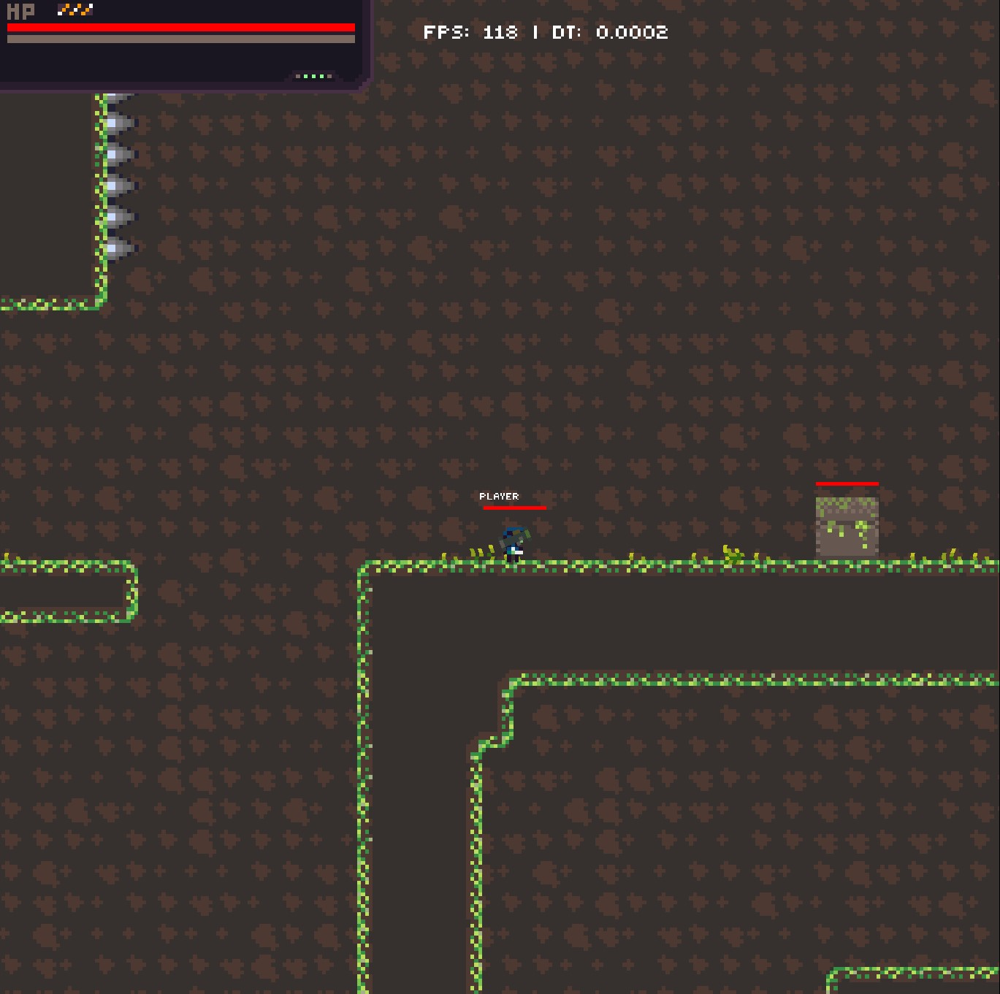
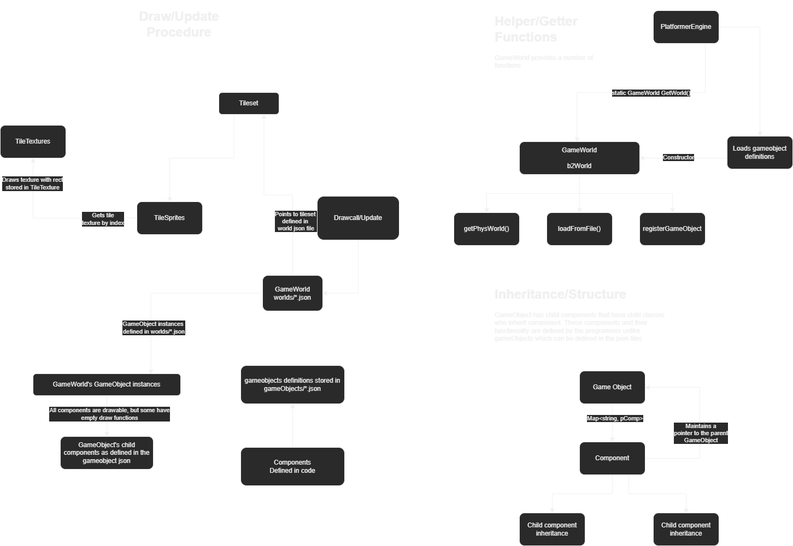

# PlatformDataEngine

A data-driven platformer game engine using SFML

## Setup

Visual Studio should automatically use `vcpkg` to install the correct dependencies. If it doesn't work, you'll need to install the following:

- tmxlite

- sfml

- box2d

- nlohmann-json

- spdlog

